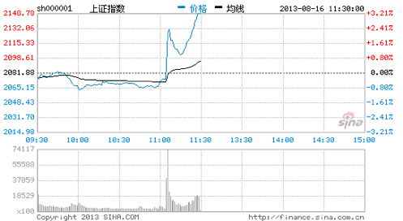
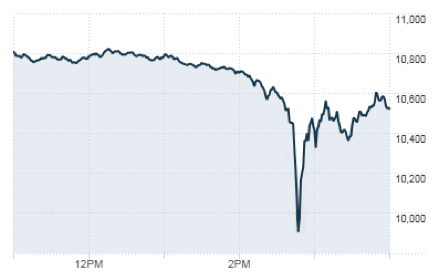
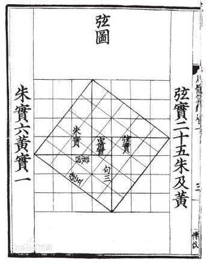
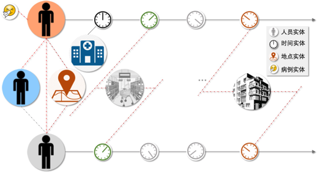
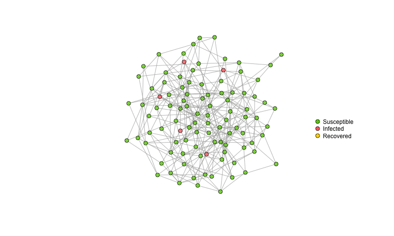
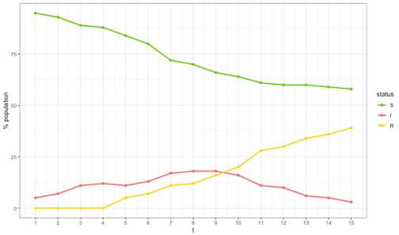
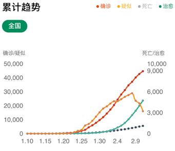

# 白话AI算法系列

# 导语

人工智能包含了三个大的主题：数据、算法、算力。围绕着这三个主题的排列组合和衍生拓展实际构成了人工智能相关的各种上中下游产品、应用以及生态。对于人工智能中台的建设，“算法”毋庸置疑是一个绕不开的话题。本章节的内容主要围绕”算法”来展开。让我们拨开迷雾，探索一下：

1.  算法究竟是什么？
2.  它从何处来？
3.  它的内在和外延又是什么？
4.  它要到何处去？

# 白话AI算法系列之一:  闪电崩盘、普林顿332和新冠

2013年8月16日11点，癸巳年·庚申月·甲寅日·午时。这是一个普通的不能再普通的日子的一个普通的不能再普通的时辰。这一天的前半段，上证指数一直在随机涨落般的低位徘徊。中午休盘时间就要到了，整个市场弥漫着一股午间特有的懈怠和平静。一切都在十一点零五分发生了巨大变化。

-   11:05-11:08短短几分钟上证指数盘涨了31点，要知道这是在13年，上证指数在8月16日以2075点低开；
-   11:15-11:30盘中2198点，波动在5%～6% ；
-   市场涌现大量买单，59只权重股瞬间封停；
-   某234亿元的巨量资金申购180 ETF成份股\[1\]，实际成交72.7亿元；

姑且不论当天下午ETF卖出和卖空股指期货等套利操作，这短短几分钟的过山车的表现，在当时的中国证券市场基本是空前的（绝后到是没有，
2016年的一月四五六七日的交易会刷新这个记录）。事后分析中，有人指出了程序员”乌龙指”把24个个股成交配置成了24组；有人指出套利算法有缺陷，导致市场大量跟风；也有人指出了风控算法和策略失效，无法适应高频量化交易；还有人直接就联想到了*327国债事件*，并把这次的事情称作中国证券交易的至暗时刻之一。但是至少有一点可一肯定，这次的市场波动如此之巨大，如此之快，范围如此之广，与统治量化交易世界的”算法”不无关系。整个事情来龙去脉若有趣的还原出来，肯定比Big
Shot有意思的多。

<figure>

<figcaption aria-hidden="true">shz816.png</figcaption>
</figure>

图 1-1：2013-08-16 上证指数（来源新浪网）；

<figure>

<figcaption aria-hidden="true">flashcrash.png</figcaption>
</figure>

图 1-2：2010 Nasdaq闪电崩溃（来源Wikipedia）

同样的事情历史上在美国也发生过，但结局更糟糕（曲线和816事件正好是镜像的）。比如至今还是罗生门的2010闪电崩盘事件（Flash
Crash）：纳斯达克在300秒内跌了998点，最低到9869.62点；期间蒸发了近万亿美元；通用电气（GE）等知名公司一度跌至一美分。这件事直到2016年才部分搞清，定位到源头之一是Navinder
Sarao--没错，一个量化交易员；但大量算法统治的市场交易的分析就没有更多线索了。外媒和中文媒体中通常把Sarao描述成”豪恩斯洛猎犬”（Hound
of
Hounslow），后者来源于小李子2013年拍的《华尔街之狼》。但是社会工学去挖掘Sarao的生活，会发现除了Spoofing和Layering这些操作，他和大多数程序员一样过着错峰上班和午饭啃着三明治的生活。有兴趣的读者可以看看Ghost
Exchange这部纪录片。

816事件也好，2010闪电崩盘也好，茶余饭后总不乏阴谋论的悄声低语。但更多时候，交易会按照模式按部就班的进行，风控系统会找到可能的风险去保证市场稳健，推荐系统会寻找更多的投资组合--当然这是在”算法”工作的时候。其实白犀牛也好，黑天鹅也好，每个呢喃的事件背后也好，“算法”早就快速的占据了我们生活的每一个细节。

“**算法**”是一个令人着迷的词汇，在大众看来，这个词充满了无穷的魔力和魅力：它可以预测哪种电视剧可以票房大卖，从而让
Netflix
通过《纸牌屋》大赚一笔；亦可以上天入地无所不能，从而找到了本·拉登，让美军精准打击到了基地的巢穴；还可以让电脑下棋胜过了卡斯帕罗夫和柯洁，让后者留下时代的眼泪。在充斥着枝枝蔓蔓和无边无沿的
PR
文（公关文）以及信息爆炸的今日，恐怕离公众（甚至很多相关从业者）最近又误解最多的一个词，应该就是”算法”这个词汇了。

算法（Algorithm），在韦氏词典的词条中，清晰的脉络是来自活跃在公元后825
年的波斯数学家 “*al-Khwārizmī*”（全名是
阿布·阿卜杜拉·穆罕穆德·穆萨·哈喇子密），后者在代数（Algrbra也同时来源于他）和计数系统上有极其重要的贡献。这个词的词源亦可追述到中古英语
“*algorisme*”，意思就是”阿拉伯计数法”(*the system of Arabic
numerals*)。直到二十世纪上半叶，算法一词才演变成我们目前看到的意思：“解题方案的准确而完整的描述，是一系列解决问题的清晰指令，算法代表着用系统的方法描述解决问题的策略机制。”(《算法导论》)，或者加而言之”任何程序化运算或自动运算方法的统称”。对这段历史感兴趣的读者可以读读《A
History of Algrithm》。

为了简单说明什么是算法，我们举两个例子。

## 勾三股四弦五

例子之一来自于大家耳熟能详的毕达哥拉斯定理，又叫做勾股定理。历史上，这个定理甚至可以追溯到三千年前美索不达米亚的石板上（这段记述被用楔形文字记录在”普林顿332”号泥板上，中国可查的见《周髀算经》或者《九章算术》）。这个定理其实在各种描述中的开始，就是一个”算法”。

图 2 左图：赵爽弦图， 右图：周髀算经

看看《周髀算经》的记载

*周公问于商高。曰：“窃闻乎大夫善数也，请问古者包牺立周天历度。夫天不可阶而升，地不可得尺寸而度，请问数安从出？”*

*商高曰：“数之法出于圆方，圆出于方，方出于矩，矩出于九九八十一。故折矩，以为句广三股脩四径隅五。既方外外半之一矩，环而共盘得成三四五，两矩共长二十有五，是谓积矩。故禹之所以治天下者，此数之所生也。”*

换成耳熟能详的现代说法或许更好理解些。

**甲方**：周公；

**乙方**：商高。

**甲方需求**：我想丈量天有多高，地有多大。

**乙方解决方案**： &gt; a. 方法论：几何测量学； &gt; &gt; b.
具体方案：使用”勾广三，股修四，径隅五”； &gt; &gt; c. 实施措施：
…（实际整本《周髀算经》都在讲这个） &gt; &gt;
d. 正确性验证：赵爽弦图可以”看”出严格证明。

 
所以当我们在抱怨甲方客户的要求天马行空、不切实际和”不懂业务”的时候，我们的老祖宗用”算法”做了一个完美的示例。

值得一提的是，“勾股定理”作为一种算法不仅仅完成度量这个任务(“**量化**”)。它还历经了”**泛化**”和再一轮”**固化**”。简单列下这个算法的”泛化-固化”历程：

       -
勾股定理导致了无理数的发现（想象下边长为”1”的等腰直角三角形，其斜边长是一个不可公度的$\sqrt{2}$），而后者似的人类在计算这件事情上开疆扩土，但也直接导致了第一次数学危机； -
欧式几何基础：应用领域从天文、测量、到工程建筑等各个方面 -
可以延拓成Minkovski metric：
*d**s*2 =  − (*c**d**t*)2 + *d**x*2 + *d**y*2 + *d**z*2，也就是狭义相对论的几何基础。 -
…

是的，`一个算法撬动了一个世界`。

## 即将逝去的Corvid 19 

第二个例子来自于最近的一个热点：传染病分析。

毋庸置疑，2019年末2020年初，整个神州大陆最高关注度的就是nCov-2019病毒的肆虐。这种长潜伏期的疾病事实上造成了巨大损伤。分析、预防、治疗等工作一直在有条不紊的进行。我们这里只讲讲算法在这里面的一个简单实例。

  首先看2020年2月的一篇网红新闻的报道：

*“*

*近期，天津宝坻区某百货大楼内部相继出现了新型冠状病毒感染的肺炎病例*

*…*

*此时，疾控专家们终于建立起了流行病学的联系。结论是：第4例在外地感染，回津以后发病，造成了百货大楼内的病毒传播。这个顾客赶上了，她也感染了。然后是第1例传染了她的丈夫。*

*“*

这个案例被称为”福尔摩斯式破解病毒传染迷局”，分析过程非常精彩，可以找当时的报道嘟嘟。我们可以抽象成两层的关系网络来刻画这个问题：

-   人际网络；
-   人-地理信息-时间信息网络。

传染途径可以抽象成`人 ->（传染）人；人 ->（污染）地点；地点 ->（传染）人`。于是简而言之，抽象成传染路径就可以示意成下图。

<figure>

<figcaption aria-hidden="true">image.png</figcaption>
</figure>

图 4 传染路径图

在各式数据齐备的情况下（这是个巨大的问题：比如如何知道某人何时在何处。这不仅是个算法和大数据问题，也涉及隐私和公共安全等诸多方面问题），发现潜在病患就演变成了这样的问题：

-   如何最高效和实时的还原一个人的行为轨迹；

-   如何准确刻画一个人的社交关系；

-   如何在绝大部份是垃圾无用信息中准确筛选出可疑的人和地点；

-   以及如何取舍误判以及漏判。

这些问题其实和”福尔摩斯”般的探案有很大关系。因为认为（**大前提**）万物皆实体，万物皆互联，那么确定（**小前提**）人-人传播可能性，就需要去寻找所有能支撑这个大小前提的论据并得到传播路径（**结论**）。也就是说”算法”和”三段论”（Syllogism）是紧密相关的。

这里只讨论”人-人传播”这个小前提的一个思维实验。在没有管控的情况下，“人
-&gt; 地点 -&gt;
人”的循环会促使疾病的传染呈现指数一般的增长。假设平均患者接触他人患病概率为5%，病人康复概率是1/3(中位数)。试想一下这种情况，怎么帮助我们怎么预估情况到底能发展到多么糟糕？答案是：使用算法。

<figure>

<figcaption aria-hidden="true">image.png</figcaption>
</figure>

上述图示的”易感-感染-恢复”（SIR模型）是流行病学研究中最简单的一个模型之一（除了更简单的不考虑恢复的易感-感染模型）。下面的动图（R语言-igraph包绘制）描绘了1000人的小世界的情形。*对”小世界”还能多说几句，它又叫做”六度分隔”理论，来源于Stanley
Milgram上世纪六十年代的一个实验：两个陌生人可以至多经过五个中间联系人取得联系。这个理论现实用中文的一句俗语来讲比较明白”人以类聚，物以群分”。人类社会形成的网络在局部通常有看起来不太自然的聚集。*

<figure>

<figcaption aria-hidden="true">GI.gif</figcaption>
</figure>

图 5 小世界图上SIR的模拟（GIF）

可以发现，不经管控的爆发是极其快速的，数个周期后，大部分的节点已经被感染（考虑到有些疾病感染后的高死亡率，就更为可怖）。

图 6 左图：简单模拟的SIR曲线随时间的关系，右图：实际的患病、恢复曲线

在2019年末到2020年初的这场浩劫中，研究人员在NEJM、Nature等顶级期刊发表的研究工作的基准模型之一都是SIR这类的流行病学和公共卫生模型（当然会更复杂，比如考略人员流动、医疗水平变化、地域因素、人员分层等）。数据、算法、算力在这场防控工作中起到了相当大的作用。

# 参考

\[1\]
ETF是交易型开放式指数基金，官方的定义是”是指经依法募集的,投资特定证券指数所对应组合证券的开放式基金”。“180”代表”在所有A股股票中抽取最具市场代表性的180种样本股票”。如何构建这样的产品是另外一个故事了。
